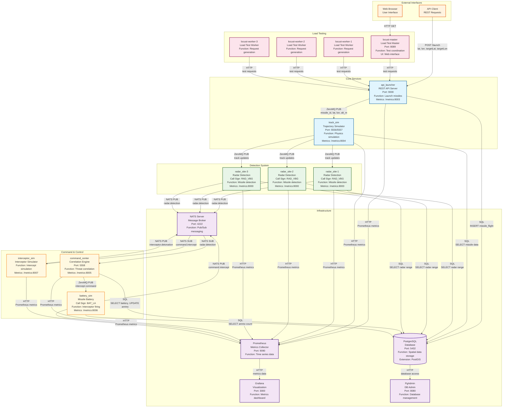
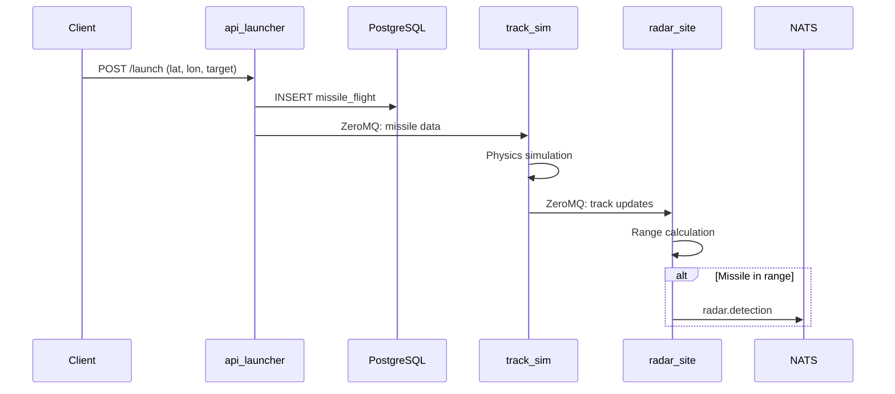
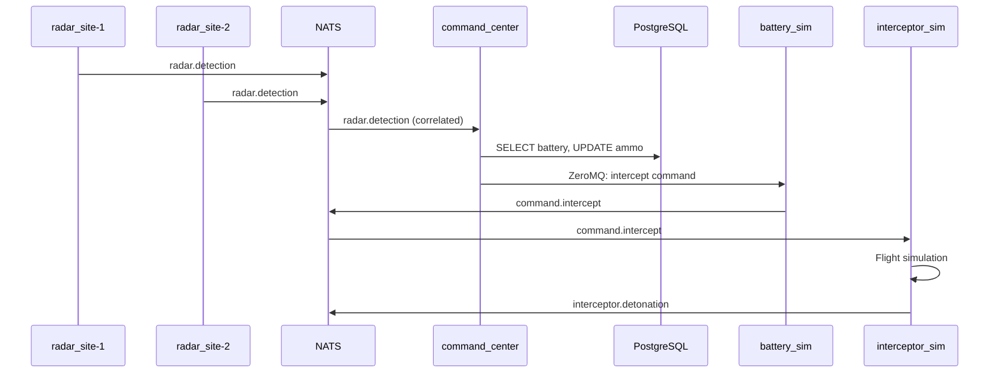

# Updates

Still working out the bugs of this portfolio project, still very much a WIP

# Missile Defense Simulator

A distributed missile defense simulation system using NATS, ZeroMQ, PostgreSQL with PostGIS, and Prometheus/Grafana for monitoring.

## System Architecture



## Message Flow Details

### 1. Missile Launch Sequence


### 2. Intercept Sequence


## Component Functions

### Core Services
- **api_launcher**: REST API for missile launches, stores flight data in PostgreSQL
- **track_sim**: Physics simulation of missile trajectories, publishes track updates via ZeroMQ

### Detection System
- **radar_site** (3 replicas): Geographic missile detection using PostGIS spatial queries
- **Functions**: Range calculation, signal-to-noise ratio simulation, detection correlation

### Command & Control
- **command_center**: Correlates multiple radar detections, selects optimal battery for intercept
- **battery_sim**: Manages ammunition, fires interceptors based on command center orders
- **interceptor_sim**: Simulates interceptor missile flight and detonation

### Infrastructure
- **NATS**: Message broker for asynchronous communication between services
- **PostgreSQL**: Spatial database with PostGIS extension for geographic calculations
- **Prometheus**: Metrics collection and time-series storage
- **Grafana**: Metrics visualization and dashboards
- **PgAdmin**: Database administration interface

### Load Testing
- **locust-master**: Coordinates distributed load testing, provides web UI
- **locust-worker** (3 replicas): Generate HTTP requests to test system performance

## Architecture

The system consists of several microservices:

- **api_launcher**: REST API for launching missiles
- **track_sim**: Simulates missile trajectories using ZeroMQ
- **radar_site**: Radar detection system (3 replicas)
- **command_center**: Correlates radar detections and orders intercepts
- **battery_sim**: Missile battery that fires interceptors
- **interceptor_sim**: Simulates interceptor missiles
- **nats**: Message broker for inter-service communication
- **postgres**: Database with PostGIS for spatial data
- **prometheus**: Metrics collection
- **grafana**: Metrics visualization
- **pgadmin**: Database administration

## Recent Fixes Applied

### 1. SQL Syntax Error in radar_site.py
- **Issue**: Malformed SQL query with inline comments causing syntax errors
- **Fix**: Properly formatted multi-line SQL query with comments outside the string

### 2. Database Connection Timing Issues
- **Issue**: Services trying to connect to PostgreSQL before it's ready
- **Fix**: Added health checks to PostgreSQL and retry logic to all services
- **Fix**: Updated docker-compose.yml with proper service dependencies

### 3. Missing asyncio Import
- **Issue**: track_sim.py missing asyncio import
- **Fix**: Added proper import and restructured the main execution

### 4. ZeroMQ Async Operations
- **Issue**: Services using blocking ZeroMQ operations in async contexts
- **Fix**: Updated all services to use proper async ZeroMQ methods (`await sock.recv()`, `await pub.send_json()`)
- **Fix**: Added proper error handling and timeouts for ZeroMQ operations

### 5. Service Dependencies
- **Issue**: Services starting before dependencies are ready
- **Fix**: Added health checks and proper dependency conditions in docker-compose.yml

## Quick Start

1. **Build and start the system**:
   ```bash
   python build_system.py
   ```
   
   Or manually:
   ```bash
   docker-compose up -d
   ```

2. **Wait for services to initialize** (check logs):
   ```bash
   docker-compose logs -f
   ```

3. **Debug the system** (if needed):
   ```bash
   python debug_system.py
   ```

4. **Test the system**:
   ```bash
   python test_system.py
   ```

5. **Monitor the system**:
   - Prometheus: http://localhost:9090
   - Grafana: http://localhost:3000 (admin/admin)
   - PgAdmin: http://localhost:8080 (admin@missilesim.com/admin123)
   - Locust: http://localhost:8089

## API Usage

### Launch a Missile
```bash
curl -X POST "http://localhost:9000/launch?lat=34.0522&lon=-118.2437&targetLat=33.7490&targetLon=-84.3880&missileType=SCUD-C"
```

### Check Metrics
```bash
curl http://localhost:8003/metrics  # api_launcher
curl http://localhost:8004/metrics  # track_sim
curl http://localhost:8005/metrics  # command_center
curl http://localhost:8006/metrics  # battery_sim
curl http://localhost:8007/metrics  # interceptor_sim
```

## Environment Variables

Copy `env-example` to `.env` and modify as needed:

- `RADAR_CALL_SIGN`: Radar site call sign (default: RAD_VBG)
- `BATTERY_CALL_SIGN`: Battery call sign (default: BAT_LA)

## Troubleshooting

### Common Issues

1. **Database connection errors**: Wait for PostgreSQL to fully initialize (check health status)
2. **Service startup failures**: Check logs with `docker-compose logs <service_name>`
3. **ZeroMQ connection issues**: Ensure services start in the correct order
4. **Async operation errors**: All ZeroMQ operations now use proper async methods
5. **Locust UI not loading**: Check if Locust services are running and port 8089 is available

### Debug Commands

```bash
# Check system health
python debug_system.py

# Check service status
docker-compose ps

# View logs for specific service
docker-compose logs -f api_launcher

# Restart specific service
docker-compose restart api_launcher

# Check database connectivity
docker-compose exec postgres pg_isready -U missiles -d missilesim

# Rebuild and restart all services
docker-compose down
docker-compose build
docker-compose up -d
```

### ZeroMQ Debugging

If you see ZeroMQ-related errors:

1. **Check socket connections**: Ensure services are binding/connecting to correct ports
2. **Verify async usage**: All ZeroMQ operations should use `await`
3. **Check timeouts**: Services use 100ms timeouts for non-blocking operations

### Locust Debugging

If Locust UI is not loading:

1. **Check Locust services**: `docker-compose ps locust-master locust-worker`
2. **Check Locust logs**: `docker-compose logs -f locust-master`
3. **Restart Locust**: `docker-compose restart locust-master locust-worker`
4. **Rebuild Locust**: `docker-compose build locust-master locust-worker`
5. **Check port availability**: `netstat -an | grep 8089`
6. **Test Locust specifically**: `python test_locust.py`

Common Locust issues:
- **Port 8089 already in use**: Stop other services using this port
- **Workers not connecting**: Check network connectivity between master and workers
- **API endpoint unreachable**: Ensure api_launcher is running and accessible

### Build Issues

If you encounter build failures:

1. **Locust build fails**: The Locust image doesn't support `apt-get` operations
   - **Solution**: Use the simplified Dockerfile (already fixed)
   - **Alternative**: `docker-compose build --no-cache locust-master locust-worker`

2. **Permission errors**: Some Docker images run as non-root users
   - **Solution**: Avoid using `apt-get` in Dockerfiles
   - **Alternative**: Use Python-based alternatives for system tools

3. **Port conflicts**: Services trying to bind to already-used ports
   - **Solution**: Stop conflicting services or change ports
   - **Check**: `netstat -an | grep <port_number>`

4. **Memory issues**: Docker running out of memory during build
   - **Solution**: Increase Docker memory allocation
   - **Alternative**: Build services individually: `docker-compose build <service_name>`

## System Flow

1. **Launch**: API receives missile launch request
2. **Track**: track_sim receives missile data via ZeroMQ and simulates trajectory
3. **Detect**: radar_site detects missiles within range and publishes to NATS
4. **Correlate**: command_center correlates multiple radar detections
5. **Intercept**: command_center orders battery to fire interceptor
6. **Destroy**: interceptor_sim simulates intercept and publishes detonation

## Metrics

The system exposes Prometheus metrics for:
- Missile launches
- Radar detections
- Intercept orders
- Battery fires
- Successful intercepts
- Correlation latency

## Development

To modify the system:

1. Edit the Python files in each service directory
2. Rebuild the affected service: `docker-compose build <service_name>`
3. Restart the service: `docker-compose restart <service_name>`

## Load Testing

The system includes Locust for load testing:
- Master: http://localhost:8089
- Workers: 3 replicas for distributed load testing

## ZeroMQ Ports

- **5556**: api_launcher → track_sim (missile launches)
- **5557**: track_sim → radar_site (track updates)
- **5558**: command_center → battery_sim (intercept orders) 