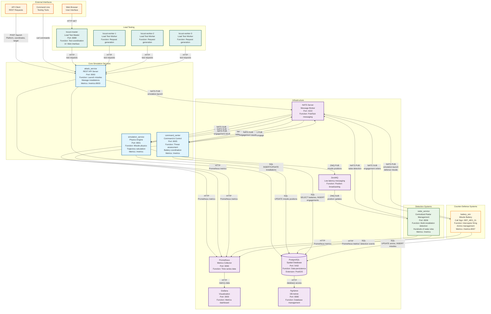
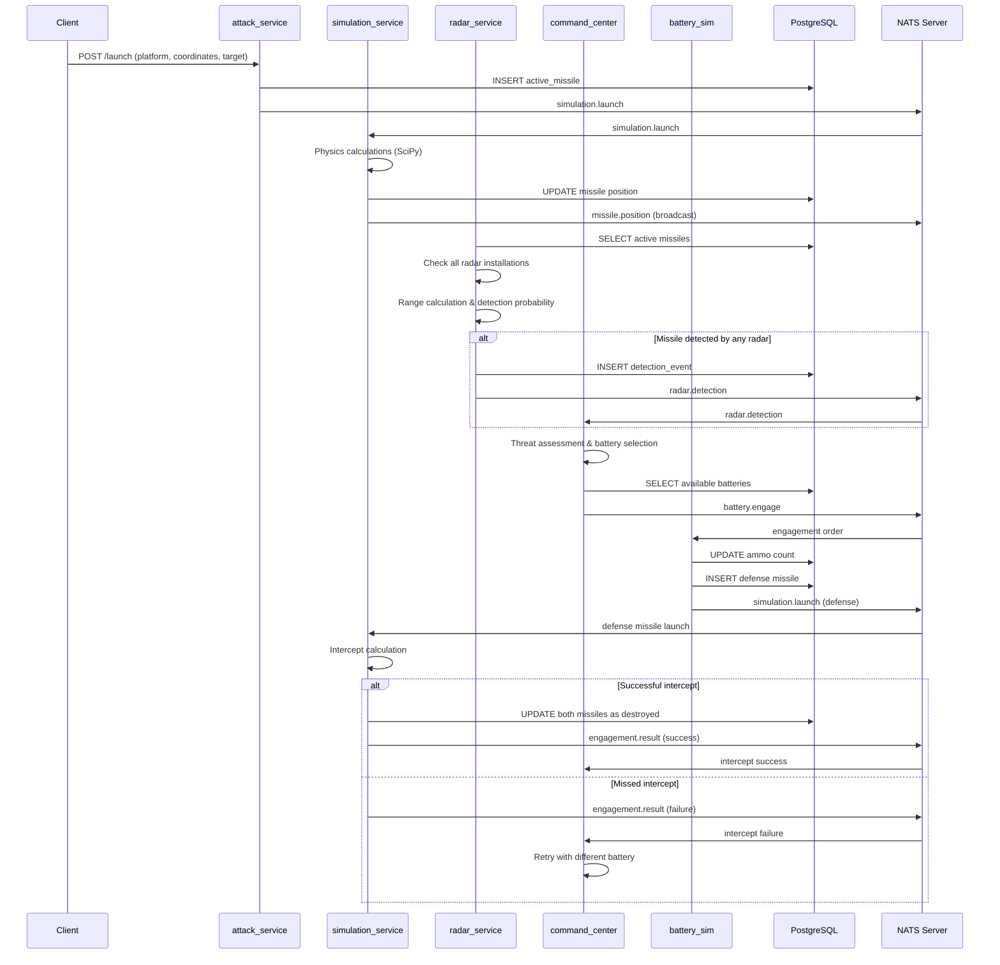

# Updates

Still working out the bugs of this portfolio project, still very much a WIP

# Missile Defense Simulation System v2.0

A comprehensive, physics-based missile defense simulation system that models realistic missile attacks, detection, and counter-defense coordination using distributed microservices.

## 🎯 Overview

This system simulates a complete missile defense scenario including:

- **Attack Platforms**: Various missile launch platforms (SCUD-V, submarines, etc.)
- **Detection Systems**: Radar installations, satellites, and tracking systems
- **Counter-Defense**: Anti-ballistic missile batteries and interceptors
- **Command & Control**: Centralized threat assessment and engagement coordination
- **Realistic Physics**: Atmospheric effects, gravity, fuel consumption, and trajectory calculations

## 🏗️ Architecture

### System Architecture Diagram



### Message Flow Sequence



### Core Services

1. **Simulation Service** (`simulation_service/`)
   - Central physics engine using SciPy for realistic trajectory calculations
   - Coordinates all missile movements and interactions
   - Handles atmospheric effects, gravity, and fuel consumption
   - Broadcasts position updates via ZMQ and NATS

2. **Attack Service** (`attack_service/`)
   - RESTful API for launching missiles and managing installations
   - Platform type management and installation configuration
   - Real-time status monitoring and metrics

3. **Command Center** (`command_center/`)
   - Threat assessment and analysis
   - Battery selection and engagement coordination
   - Retry logic with intelligent battery selection
   - Maximum 3 engagement attempts per target

4. **Radar Service** (`radar_service/`)
   - **Centralized radar management** supporting hundreds of installations
   - Realistic detection with probability-based calculations
   - Parallel processing of multiple radar sites
   - Track management and confidence scoring
   - Efficient resource utilization with thread pools

5. **Battery Simulation** (`battery_sim/`)
   - Counter-missile launch coordination
   - Ammunition management and reload timing
   - Engagement preparation and execution

### Infrastructure

- **PostgreSQL + PostGIS**: Spatial database with comprehensive schema
- **NATS**: High-performance messaging for service communication
- **ZeroMQ**: Low-latency position broadcasting
- **Prometheus**: Metrics collection and monitoring
- **Grafana**: Visualization and dashboards

### Scenario-Based Testing

The system includes comprehensive scenario-based testing using Locust for realistic military simulations:

#### Available Scenarios

1. **Defend Hawaii** (`defend_hawaii`)
   - **Description**: Chinese submarine attack on Hawaii
   - **Attackers**: Chinese submarines with JL-2, DF-21D, CJ-10 missiles
   - **Defenses**: US Aegis BMD, THAAD, Patriot systems
   - **Complexity**: Medium

2. **Iron Dome** (`iron_dome`)
   - **Description**: Israeli Iron Dome defense against rocket attacks
   - **Attackers**: Insurgency groups with Qassam, Grad, Fajr-5 rockets
   - **Defenses**: Iron Dome, David's Sling, Arrow 3 systems
   - **Complexity**: Low-Medium

3. **WW3** (`ww3`)
   - **Description**: Full-scale WW3: US vs Russia, China, North Korea
   - **Attackers**: Multiple nations with strategic missiles
   - **Defenses**: Complete US missile defense network
   - **Complexity**: High

4. **NATO Defense** (`nato_defense`)
   - **Description**: NATO defense against Russian aggression in Europe
   - **Attackers**: Russian tactical and strategic systems
   - **Defenses**: European air defense systems
   - **Complexity**: Medium

5. **Middle East Conflict** (`middle_east`)
   - **Description**: Regional conflict in the Middle East
   - **Attackers**: Iranian and Houthi forces
   - **Defenses**: Saudi Arabian defense systems
   - **Complexity**: Medium

#### Running Scenarios

**Using Locust (Load Testing):**
```bash
# Start the system
docker-compose up -d

# Run Locust master
docker-compose up locust-master

# Run Locust workers
docker-compose up locust-worker

# Access Locust UI at http://localhost:8089
```

**Using Scenario Runner (Individual Scenarios):**
```bash
# List available scenarios
python locust/scenario_runner.py --list

# Run specific scenario (automatically sets up installations via API)
python locust/scenario_runner.py defend_hawaii
python locust/scenario_runner.py iron_dome --delay 3
python locust/scenario_runner.py ww3 --simulation-api http://localhost:8001

# Run with custom parameters
python locust/scenario_runner.py middle_east --delay 2 --simulation-api http://localhost:8001
```

#### Simulation Service API

The simulation service now provides a REST API for managing installations and scenarios:

**Health Check:**
```bash
curl http://localhost:8001/health
```

**Get All Installations:**
```bash
curl http://localhost:8001/installations
```

**Create Installation:**
```bash
curl -X POST http://localhost:8001/installations \
  -H "Content-Type: application/json" \
  -d '{
    "platform_type_nickname": "Aegis BMD SM-3",
    "callsign": "DEF_AEGIS_01",
    "lat": 34.20,
    "lon": -118.50,
    "altitude_m": 0,
    "is_mobile": false,
    "ammo_count": 32
  }'
```

**Set Up Complete Scenario:**
```bash
curl -X POST http://localhost:8001/scenarios/setup \
  -H "Content-Type: application/json" \
  -d '{
    "scenario_name": "defend_hawaii",
    "installations": [
      {
        "platform_type_nickname": "Aegis BMD SM-3",
        "callsign": "DEF_AEGIS_01",
        "lat": 21.31,
        "lon": -157.86,
        "altitude_m": 0,
        "is_mobile": false,
        "ammo_count": 32
      }
    ]
  }'
```

**Get Platform Types:**
```bash
curl http://localhost:8001/platform-types
```

**Delete Installation:**
```bash
curl -X DELETE http://localhost:8001/installations/DEF_AEGIS_01
```

#### Scenario Configuration

Scenarios are defined in `locust/scenarios.py` with detailed configurations including:
- **Target locations** and defense systems
- **Attacker positions** and platform types
- **Launch phases** with timing and coordination
- **Realistic coordinates** and military platforms
- **Variable complexity** levels for different testing needs

Each scenario includes:
- Realistic geographic coordinates
- Appropriate military platforms by nation
- Phased attack sequences
- Defense system responses
- Timing and coordination parameters

#### Dynamic Installation Management

The system now supports dynamic installation management:
- **No Database Defaults**: All installations are created via API calls
- **Scenario-Specific Setup**: Each scenario creates its own installations
- **Automatic Cleanup**: Previous installations are cleared when setting up new scenarios
- **Realistic Positioning**: Installations are placed with appropriate geographic distribution
- **Ammunition Management**: Each installation has realistic ammunition counts

## 🚀 Quick Start

### Prerequisites

- Docker and Docker Compose
- Python 3.11+ (for local development)

### Installation

1. **Clone the repository**
   ```bash
   git clone <repository-url>
   cd missile-defense-sim
   ```
   
2. **Start the system**
   ```bash
   docker-compose up -d
   ```

3. **Access services**
   - API Documentation: http://localhost:9000/docs
   - Grafana Dashboard: http://localhost:3000 (admin/admin)
   - Prometheus: http://localhost:9090
   - PgAdmin: http://localhost:8080 (admin@missilesim.com/admin123)

### Basic Usage

1. **Launch an attack missile**
   ```bash
   curl -X POST "http://localhost:9000/launch" \
     -H "Content-Type: application/json" \
     -d '{
       "platform_nickname": "SCUD-V Platform",
       "launch_callsign": "ATK_SCUD_01",
       "launch_lat": 34.05,
       "launch_lon": -118.25,
       "launch_alt": 0,
       "target_lat": 34.10,
       "target_lon": -118.00,
       "target_alt": 0,
       "missile_type": "attack"
     }'
   ```

2. **Monitor active missiles**
   ```bash
   curl "http://localhost:9000/missiles/active"
   ```

3. **View recent detections**
   ```bash
   curl "http://localhost:9000/detections/recent"
   ```

## 📊 Database Schema

### Core Tables

- **`platform_type`**: Platform capabilities and characteristics
- **`installation`**: Physical locations of all systems
- **`active_missile`**: Currently flying missiles (attack and defense)
- **`detection_event`**: Radar detection records
- **`engagement`**: Counter-missile engagement attempts
- **`detonation_event`**: Impact and explosion records

### Platform Categories

1. **Launch Platforms** (`launch_platform`)
   - SCUD-V Platform
   - Type-093A Shang-II Class Submarine
   - DF-21D Platform
   - Iskander-M Platform

2. **Detection Systems** (`detection_system`)
   - EL/M-2084 Radar
   - LTAMDS Radar
   - NGP/NGG Satellite
   - X-BAND Radar
   - Forward Based Radar
   - Ground Based Tracking Radar

3. **Counter-Defense Systems** (`counter_defense`)
   - Aegis Ballistic Missile Defense System
   - LIM-49 Nike Zeus Anti Ballistic Missile
   - THAAD System
   - Patriot PAC-3
   - SM-3 Block IIA

## 🔧 Configuration

### Environment Variables

- `DB_DSN`: PostgreSQL connection string
- `CALL_SIGN`: Service-specific callsign
- `RADAR_CALL_SIGN`: Radar installation callsign
- `BATTERY_CALL_SIGN`: Battery installation callsign

### Simulation Parameters

Key physics parameters are configurable in the database:

- `simulation_tick_ms`: Update interval (default: 100ms)
- `physics_gravity_mps2`: Gravitational acceleration
- `physics_air_density_sea_level`: Atmospheric density
- `max_engagement_retries`: Maximum counter-missile attempts (default: 3)

## 📈 Monitoring

### Prometheus Metrics

- **Missile Operations**: Launches, detections, engagements, intercepts
- **System Performance**: Response times, throughput, error rates
- **Resource Usage**: CPU, memory, database connections
- **Business Metrics**: Success rates, threat levels, battery status
- **Radar Metrics**: Detection counts per installation, latency, false alarms

### Grafana Dashboards

Pre-configured dashboards for:
- Real-time missile tracking
- System performance monitoring
- Engagement success rates
- Threat assessment visualization
- Radar coverage and detection statistics

## 🎮 Advanced Features

### Realistic Physics

- **Atmospheric Effects**: Air density variation with altitude
- **Gravitational Forces**: Accurate gravity calculations
- **Fuel Consumption**: Realistic fuel burn rates
- **Drag Forces**: Aerodynamic drag based on velocity and altitude

### Intelligent Defense

- **Threat Assessment**: Multi-factor threat level calculation
- **Battery Selection**: Optimal battery selection based on range, accuracy, and availability
- **Retry Logic**: Automatic retry with different batteries on failure
- **Intercept Prediction**: Advanced trajectory analysis for intercept points

### Scalable Architecture

- **Microservices**: Independent, scalable service components
- **Message Queuing**: Reliable communication via NATS and ZeroMQ
- **Spatial Database**: Efficient geographic queries with PostGIS
- **Metrics Collection**: Comprehensive monitoring with Prometheus
- **Centralized Radar Management**: Efficient handling of hundreds of radar installations

## 🧪 Testing

### Load Testing

Use Locust for performance testing:

```bash
# Access Locust UI
http://localhost:8089

# Run load tests
docker-compose run locust-worker
```

### API Testing

```bash
# Health check
curl http://localhost:9000/health

# Get available platforms
curl http://localhost:9000/platforms

# Get installations
curl http://localhost:9000/installations
```

## 🔍 Troubleshooting

### Common Issues

1. **Database Connection Errors**
   - Ensure PostgreSQL is healthy: `docker-compose ps postgres`
   - Check connection string in environment variables

2. **Service Communication Issues**
   - Verify NATS is running: `docker-compose ps nats`
   - Check service dependencies in docker-compose.yml

3. **Physics Calculation Errors**
   - Ensure simulation service has sufficient memory
   - Check SciPy and NumPy versions in requirements

4. **Radar Performance Issues**
   - Monitor radar service metrics for high CPU usage
   - Adjust thread pool size for large numbers of installations

### Logs

```bash
# View all service logs
docker-compose logs -f

# View specific service logs
docker-compose logs -f simulation_service
docker-compose logs -f radar_service
docker-compose logs -f command_center
```

## 🤝 Contributing

1. Fork the repository
2. Create a feature branch
3. Make your changes
4. Add tests for new functionality
5. Submit a pull request

## 📄 License

This project is licensed under the MIT License - see the LICENSE file for details.

## 🙏 Acknowledgments

- Real-world missile defense system specifications
- Physics calculations based on publicly available data
- Military platform characteristics from open sources