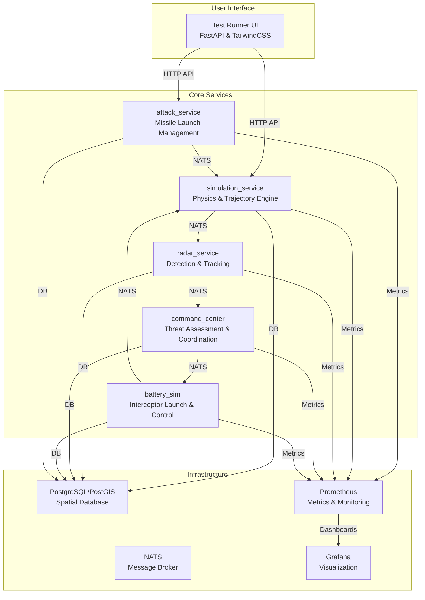
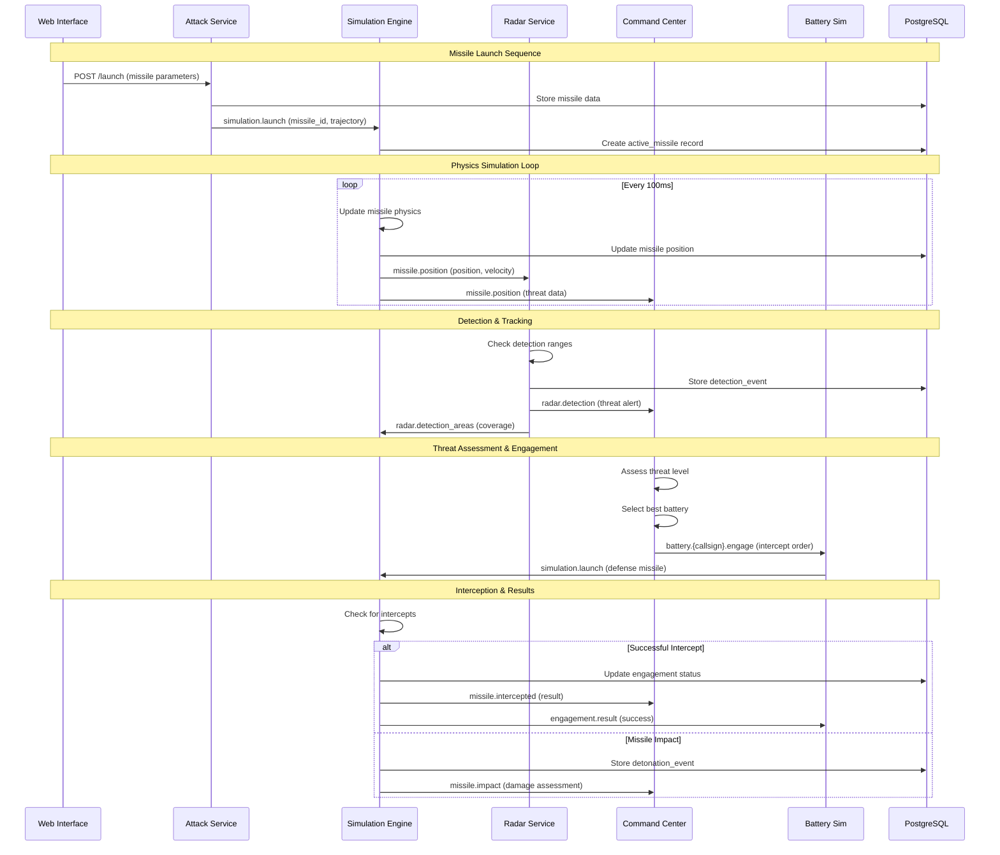

# Missile Defense Simulation System

A comprehensive, physics-based missile defense simulation system that models realistic missile attacks, detection, and counter-defense coordination using distributed microservices and event-driven architecture.

## 🎯 Overview

This system simulates a complete missile defense scenario including:

- **Attack Scenarios**: Launch missile attacks from various platforms (ballistic missiles, cruise missiles, etc.)
- **Detection Systems**: Radar installations for tracking and detection with realistic coverage areas
- **Counter-Defense**: Anti-ballistic missile batteries for interception with engagement coordination
- **Command & Control**: Centralized threat assessment and engagement coordination
- **Realistic Physics**: Atmospheric effects, gravity, underwater/air transitions, and trajectory calculations
- **Web Interface**: A comprehensive FastAPI-based UI for testing, monitoring, and real-time visualization
- **Event-Driven Architecture**: NATS message broker for real-time communication between services

## 🏗️ Architecture

The system is built on a microservices architecture with event-driven communication. Each service is responsible for a specific domain and communicates through NATS messaging and PostgreSQL for persistent state.

### System Architecture Diagram



### Event-Driven Message Flow



### Services

- **`test_running`**: A FastAPI-based web interface for running test scenarios, monitoring system status, and visualizing engagements in real-time. Provides REST APIs and web UI for scenario management.

- **`attack_service`**: Manages missile launch scenarios and communicates launch events to the simulation service. Handles platform types, installations, and missile launch requests.

- **`simulation_service`**: The core physics engine that calculates missile trajectories, handles intercepts, and manages the simulation state. Uses realistic physics models including atmospheric drag, gravity variations, and underwater/air transitions.

- **`radar_service`**: Simulates radar installations that detect and track missiles. Publishes detection events and maintains coverage area information for the simulation engine.

- **`command_center`**: Assesses threats detected by the radar service, coordinates defensive actions, and selects optimal batteries for engagement based on threat analysis and battery capabilities.

- **`battery_sim`**: Simulates missile defense batteries that fire interceptors based on commands from the command center. Manages individual battery state and engagement results.

## 🚀 Getting Started

### Prerequisites

- Docker and Docker Compose
- At least 4GB RAM available for the simulation

### Quick Start

1. Clone the repository:
```bash
git clone <repository-url>
cd missile-defense-sim
```

2. Start the system:
```bash
docker-compose up --build
```

3. Access the web interface at `http://localhost:8089`

4. Access monitoring dashboards:
   - Grafana: `http://localhost:3000` (admin/admin)
   - Prometheus: `http://localhost:9090`
   - PgAdmin: `http://localhost:8080` (admin@missilesim.com/admin123)

### Environment Configuration

Copy the example environment file and customize as needed:
```bash
cp env-example .env
```

Key environment variables:
- `BATTERY_CALL_SIGN`: Default battery callsign for testing
- Database credentials (configured in docker-compose.yml)

## 🖥️ Web Interface

The web interface provides a centralized platform for interacting with the simulation.

### Features

- **Dashboard**: Real-time overview of system status, active missiles, and recent events
- **Scenarios**: Pre-configured test scenarios that can be launched with a single click
- **Status Monitoring**: Detailed view of system health, running tests, and performance metrics
- **Real-time Visualization**: Live map showing missile trajectories, intercepts, and key events
- **Installation Management**: Create, configure, and manage radar and battery installations
- **Theme Switching**: Light/dark mode theme switcher for improved usability

### API Endpoints

The system exposes REST APIs for programmatic access:

- **Attack Service** (`http://localhost:9000`): Missile launch and platform management
- **Simulation Service** (`http://localhost:8001`): Physics engine and scenario management
- **Radar Service** (`http://localhost:8006`): Detection and tracking data
- **Command Center** (`http://localhost:8005`): Threat assessment and engagement coordination
- **Battery Sim** (`http://localhost:8007`): Individual battery status and control

## 📊 Monitoring & Observability

### Metrics Collection

The system uses Prometheus for metrics collection with custom metrics for:
- Missile position updates and trajectories
- Detection events and radar coverage
- Engagement attempts and success rates
- Physics calculation performance
- Service health and response times

### Logging

All services provide structured logging with correlation IDs for tracing requests across the distributed system.

### Health Checks

Each service exposes health check endpoints for monitoring system status and database connectivity.

## 🔧 Development

### Service Development

Each service follows a consistent structure:
- `api.py`: FastAPI application and REST endpoints
- `messaging.py`: Database operations and NATS communication
- `*_logic.py`: Core business logic (where applicable)
- `Dockerfile`: Container configuration
- `requirements.txt`: Python dependencies

### Adding New Services

1. Create a new service directory with the standard structure
2. Add the service to `docker-compose.yml`
3. Implement NATS messaging patterns for service communication
4. Add Prometheus metrics for monitoring
5. Update the web interface to include new service endpoints

### Testing

The system includes comprehensive test scenarios covering:
- Single missile launches
- Multi-missile attacks
- Radar detection scenarios
- Battery engagement tests
- End-to-end defense scenarios

## 📈 Performance

The simulation engine is optimized for real-time performance:
- Physics calculations run at 10Hz (100ms intervals)
- NATS messaging provides sub-millisecond latency
- PostgreSQL with PostGIS handles spatial queries efficiently
- Prometheus metrics collection has minimal overhead

## 🔒 Security

- All services run in isolated Docker containers
- Database credentials are managed through environment variables
- No sensitive data is exposed in logs or metrics
- Network communication is internal to the Docker network

## 📝 License

[Add your license information here]

## 🤝 Contributing

[Add contribution guidelines here]